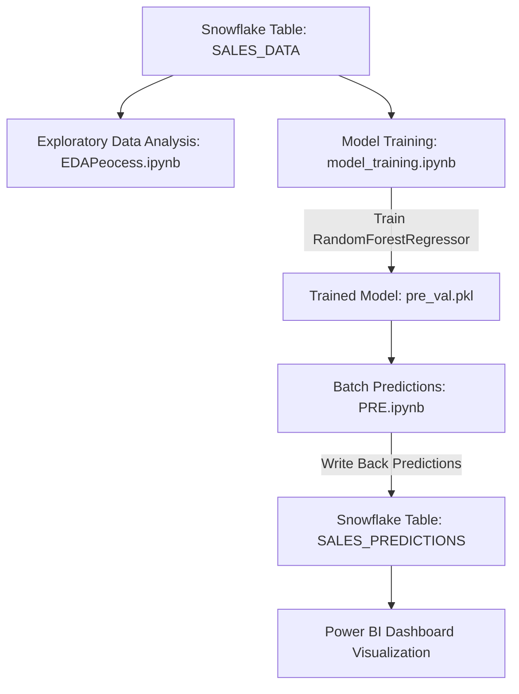

# Sales Forecasting & Analytics Pipeline

An end-to-end data engineering and machine learning pipeline that extracts historical sales data, performs exploratory analysis, trains predictive forecasting models, loads predictions back to a Snowflake Cloud Data Warehouse, and visualizes key business insights.

---

## 🚀 Project Overview

This repository contains a complete pipeline designed to forecast sales amounts and analyze business trends.

---

## 🛠️ Technology Stack

- **Data Warehouse**: Snowflake Cloud Data Warehouse
- **Languages**: Python, SQL
- **Libraries**: Pandas, NumPy, Scikit-Learn, SQLAlchemy, Joblib, Snowflake Connector for Python, Matplotlib
- **BI & Visualizations**: Power BI (Dashboard Mockups)

---

## 📁 Repository Structure

- 📊 **Data Prep & Extraction**
  - [sales.ipynb](file:///c:/Users/kumar/OneDrive/Documents/Sales-Forecasting/sales.ipynb): Initial warehouse setup, database configuration, database schema schema creation, and SQL queries to set up the raw `SALES_DATA` and predicted `SALES_PREDICTIONS` tables in Snowflake.
  - [Sales_forecast.ipynb](file:///c:/Users/kumar/OneDrive/Documents/Sales-Forecasting/Sales_forecast.ipynb): Connection scripts using `snowflake-connector-python` and Pandas to fetch data from the warehouse for exploratory queries.

- 📈 **Exploratory Data Analysis (EDA)**
  - [EDAPeocess.ipynb](file:///c:/Users/kumar/OneDrive/Documents/Sales-Forecasting/EDAPeocess.ipynb): Statistical analysis and visualizations focusing on regional performance, customer segments, sales channels, discount trends, and monthly growth patterns.

- 🤖 **Machine Learning**
  - [model_training.ipynb](file:///c:/Users/kumar/OneDrive/Documents/Sales-Forecasting/model_training.ipynb): Core model development pipeline. Splits dataset, trains Linear Regression and Random Forest models, performs feature importance rankings, and exports the final model to `pre_val.pkl`.
  - [PRE.ipynb](file:///c:/Users/kumar/OneDrive/Documents/Sales-Forecasting/PRE.ipynb): Production inference notebook. Loads the trained RandomForest model, predicts sales on test datasets, and writes the batch predictions back into Snowflake.
  - [predictions.ipynb](file:///c:/Users/kumar/OneDrive/Documents/Sales-Forecasting/predictions.ipynb): Sandbox/debugging notebook mapping intermediate issues resolved during prediction pipeline development.

- 🎨 **Visualizations & Assets**
  - [dashboard.png](file:///c:/Users/kumar/OneDrive/Documents/Sales-Forecasting/dashboard.png) / [overview.png](file:///c:/Users/kumar/OneDrive/Documents/Sales-Forecasting/overview.png): Enterprise dashboard visualizations of key sales metrics and performance.
  - [region slicer.png](file:///c:/Users/kumar/OneDrive/Documents/Sales-Forecasting/region%20slicer.png) / [slicer.png](file:///c:/Users/kumar/OneDrive/Documents/Sales-Forecasting/slicer.png): Visual aids demonstrating filtering options used within the interactive dashboard reports.

---

## 🗄️ Database Schema Details (Snowflake)

### 1. Raw Sales Data (`SALES_DATA`)
| Column Name | Data Type | Description |
| :--- | :--- | :--- |
| `PRODUCT_ID` | NUMBER | Unique identifier for each product |
| `SALE_DATE` | DATE | Date of transaction |
| `SALES_REP` | STRING | Name of sales representative |
| `REGION` | STRING | Target region (North, South, East, West) |
| `SALES_AMOUNT` | FLOAT | Monetary value of the sale |
| `QUANTITY_SOLD` | NUMBER | Total units sold |
| `PRODUCT_CATEGORY` | STRING | Categorized product group (Furniture, Clothing, Electronics) |
| `UNIT_COST` | FLOAT | Cost price per single unit |
| `UNIT_PRICE` | FLOAT | Retail price per single unit |
| `CUSTOMER_TYPE` | STRING | Segment (New, Returning) |
| `DISCOUNT` | FLOAT | Applied percentage discount |
| `PAYMENT_METHOD` | STRING | Cash, Credit Card, etc. |
| `SALES_CHANNEL` | STRING | Retail, Online, etc. |
| `REGION_AND_SALES_REP` | STRING | Concatenated helper key |

### 2. Predictions Output (`SALES_PREDICTIONS`)
| Column Name | Data Type | Description |
| :--- | :--- | :--- |
| `PREDICTION_ID` | INTEGER | Autoincrementing primary key |
| `SALE_DATE` | DATE | Date of forecasted sale |
| `REGION` | STRING | Target region |
| `PRODUCT_CATEGORY` | STRING | Categorized product group |
| `ACTUAL_SALES` | FLOAT | Recorded historical sales amount |
| `PREDICTED_SALES` | FLOAT | Model-generated predicted sales amount |
| `MODEL_NAME` | STRING | Algorithm descriptor (e.g. "Random Forest") |
| `CREATED_AT` | TIMESTAMP | Entry ingestion timestamp |

---

## 📊 Model Evaluation & Insights

Two regressions models were evaluated on the dataset:

| Model Name | MAE | RMSE | R² Score |
| :--- | :--- | :--- | :--- |
| **Random Forest Regressor** | **413.16** | **617.65** | **0.9587** |
| Linear Regression | 2373.56 | 2677.52 | 0.2242 |

### 💡 Feature Importance Highlights
The Random Forest model identified the following features as key drivers for forecasting sales amounts:
1. **REVENUE_PER_UNIT** (73.07% importance)
2. **QUANTITY_SOLD** (21.75% importance)
3. **PROFIT** (1.11% importance)

---

## 🛠️ Step-by-Step Execution Guide

### 1. Database Setup
Execute the commands within the [sales.ipynb](file:///c:/Users/kumar/OneDrive/Documents/Sales-Forecasting/sales.ipynb) notebook to set up the Snowflake connection parameters, create the warehouse, database, and initialize the target tables.

### 2. Feature Engineering & Training
Run [model_training.ipynb](file:///c:/Users/kumar/OneDrive/Documents/Sales-Forecasting/model_training.ipynb) to load raw datasets, generate time-based attributes (Year, Quarter, Month, Week, Day of Week), train the Random Forest model, and export the trained binary object to a pickle file.

### 3. Forecasting & Upload
Execute the production script [PRE.ipynb](file:///c:/Users/kumar/OneDrive/Documents/Sales-Forecasting/PRE.ipynb) to load the pickled model file, predict forecasted values on the operational datasets, and perform batch inserts back to Snowflake `SALES_PREDICTIONS`.

### 4. BI Analytics
Connect your Power BI dashboard instance to Snowflake and import the `SALES_PREDICTIONS` table alongside the `SALES_SUMMARY` view to generate visualizations representing actuals vs. forecasts, as shown in the project dashboard captures:
- [dashboard.png](file:///c:/Users/kumar/OneDrive/Documents/Sales-Forecasting/dashboard.png)
- [overview.png](file:///c:/Users/kumar/OneDrive/Documents/Sales-Forecasting/overview.png)