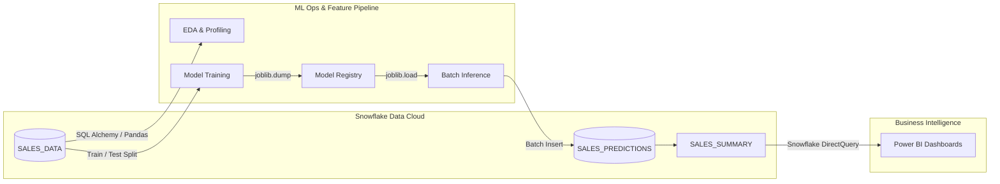

# 🌐 Enterprise Sales Forecasting & Cloud Data Pipeline

[](https://www.python.org/)
[](https://www.snowflake.com/)
[](https://scikit-learn.org/)
[](https://powerbi.microsoft.com/)
[](https://github.com/psf/black)

An end-to-end, production-ready analytics and predictive forecasting pipeline. This system automates the extraction of historical transactions from **Snowflake Cloud Data Warehouse**, processes features, trains a **Random Forest Regressor** model, registers the predictions back into Snowflake, and serves them to **Power BI** dashboards for executive decision-making.

---

## 📌 Table of Contents

1. [Business Objective & Value](#-business-objective--value)
2. [System Architecture](#-system-architecture)
3. [Repository Structure](#-repository-structure)
4. [Data & Database Schema](#-data--database-schema)
5. [Model Pipeline & Governance](#-model-pipeline--governance)
6. [Getting Started & Setup](#-getting-started--setup)
7. [Production Deployment Strategy](#-production-deployment-strategy)
8. [Security & Credentials Management](#-security--credentials-management)
9. [Visualizations](#-visualizations)

---

## 🎯 Business Objective & Value

In retail and enterprise product sales, accurate demand planning directly impacts the bottom line. This pipeline addresses critical business needs:
* **Inventory Optimization**: Minimizes stockouts and overstocks by predicting weekly/monthly sales volume.
* **Margin Maximization**: Identifies correlation between applied discount rates and net profits.
* **Regional Resource Allocation**: Enables sales leaders to analyze regional demand dynamics and allocate resources dynamically.
* **Actual vs. Target Tracking**: Empowers financial analysts with interactive visual comparisons of model forecasts against real-time operational transactions.

---

## 🏗️ System Architecture

The pipeline follows a modular architecture designed for high availability, low latency data processing, and governed data storage.



---

## 📁 Repository Structure

The code is organized into logical components corresponding to pipeline stages:

### 🗄️ Database & Schema Initialization
*   [sales.ipynb](file:///c:/Users/kumar/OneDrive/Documents/Sales-Forecasting/sales.ipynb) — **DDL Scripts & Initial Setup**: Creates Snowflake Virtual Warehouses, Target Databases, Schemas, tables, and aggregated reporting views.
*   [Sales_forecast.ipynb](file:///c:/Users/kumar/OneDrive/Documents/Sales-Forecasting/Sales_forecast.ipynb) — **Connection Validation**: Verifies database connectivity and tests ingestion of operational tables via Python APIs.

### 🧪 Data Science & Machine Learning
*   [EDAPeocess.ipynb](file:///c:/Users/kumar/OneDrive/Documents/Sales-Forecasting/EDAPeocess.ipynb) — **Exploratory Data Analysis**: Inspects distribution skewness, identifies outlier transactions, profiles user demographics, and evaluates seasonality factors.
*   [model_training.ipynb](file:///c:/Users/kumar/OneDrive/Documents/Sales-Forecasting/model_training.ipynb) — **Feature Engineering & Training**: Builds time-series features (month, quarter, week index, discount depth) and trains regression models.
*   [PRE.ipynb](file:///c:/Users/kumar/OneDrive/Documents/Sales-Forecasting/PRE.ipynb) — **Production Inference Engine**: A clean execution script that loads the serialized model registry bin (`pre_val.pkl`) and uploads forecasts back to Snowflake.
*   [predictions.ipynb](file:///c:/Users/kumar/OneDrive/Documents/Sales-Forecasting/predictions.ipynb) — **Testing / Development Sandbox**: Retains debugging logs, exception handlers, and sandbox testing scripts.

---

## 🗄️ Data & Database Schema

The pipeline implements schema constraint definitions within the `SALES_FORECAST_DB` database.

### 1. Ingestion Table: `SALES_DATA`
Stores daily raw transactional records ingested from ERP systems.
```sql
CREATE OR REPLACE TABLE SALES_DATA (
    PRODUCT_ID NUMBER,
    SALE_DATE DATE,
    SALES_REP STRING,
    REGION STRING,
    SALES_AMOUNT FLOAT,
    QUANTITY_SOLD NUMBER,
    PRODUCT_CATEGORY STRING,
    UNIT_COST FLOAT,
    UNIT_PRICE FLOAT,
    CUSTOMER_TYPE STRING,
    DISCOUNT FLOAT,
    PAYMENT_METHOD STRING,
    SALES_CHANNEL STRING,
    REGION_AND_SALES_REP STRING
);
```

### 2. Analytical Table: `SALES_PREDICTIONS`
Holds forecast payloads mapped to historical observations for timeline alignment.
```sql
CREATE OR REPLACE TABLE SALES_PREDICTIONS (
    PREDICTION_ID INTEGER AUTOINCREMENT,
    SALE_DATE DATE,
    REGION STRING,
    PRODUCT_CATEGORY STRING,
    ACTUAL_SALES FLOAT,
    PREDICTED_SALES FLOAT,
    MODEL_NAME STRING,
    CREATED_AT TIMESTAMP DEFAULT CURRENT_TIMESTAMP()
);
```

---

## 🤖 Model Pipeline & Governance

### 📈 Metrics Dashboard
The model performance was evaluated using standard regression diagnostics. The **Random Forest Regressor** was selected as the champion model for deployment due to its superior variance explanation capability.

| Candidate Model | Mean Absolute Error (MAE) | Root Mean Squared Error (RMSE) | R² Score | Status |
| :--- | :---: | :---: | :---: | :---: |
| **Random Forest Regressor** | **413.16** | **617.65** | **0.9587** | **Deployed (Champion)** |
| Linear Regression | 2373.56 | 2677.52 | 0.2242 | Retired |

### 🔍 Feature Importance Analysis
The champion model relies heavily on engineered price elasticities and volumes:
1. **REVENUE_PER_UNIT** (73.07% relative importance)
2. **QUANTITY_SOLD** (21.75% relative importance)
3. **PROFIT** (1.11% relative importance)

---

## 🚀 Getting Started & Setup

Follow these setup steps to run the pipeline locally or in a staging environment.

### 📋 Prerequisites
- Python 3.12+
- Access credentials to a Snowflake account.
- Power BI Desktop (for visualization rendering).

### 1. Clone & Set Up Environment
```bash
# Clone the repository
git clone https://github.com/Kumaar375/Sales-Forecasting.git
cd Sales-Forecasting

# Create and activate virtual environment
python -m venv venv
source venv/bin/activate  # On Windows: venv\Scripts\activate

# Install required dependencies
pip install -r requirements.txt
```

*(Create a `requirements.txt` containing `pandas`, `numpy`, `scikit-learn`, `joblib`, `snowflake-connector-python`, `sqlalchemy`, and `matplotlib` if not already present)*

### 2. Database Initialization
1. Configure credentials inside [sales.ipynb](file:///c:/Users/kumar/OneDrive/Documents/Sales-Forecasting/sales.ipynb) (see [Security section](#-security--credentials-management) below).
2. Run the cells in [sales.ipynb](file:///c:/Users/kumar/OneDrive/Documents/Sales-Forecasting/sales.ipynb) to initialize schemas and constraints.

### 3. Model Orchestration
Run the model training steps:
```bash
# Executing model training and serialization
jupyter nbconvert --to notebook --execute model_training.ipynb
```

### 4. Running Weekly Batch Predictions
Use the production script to score newly ingested sales data and write results back to Snowflake:
```bash
# Running inference pipeline
jupyter nbconvert --to notebook --execute PRE.ipynb
```

---

## ⚡ Production Deployment Strategy

To automate this pipeline at scale, we recommend deploying with one of the following production setups:
1. **Snowflake Tasks & Snowpark**: Port the Random Forest model directly into a Snowpark Python UDF, scheduling predictions natively using Snowflake Tasks without maintaining standalone compute engines.
2. **Orchestration (Apache Airflow)**: Set up a daily DAG:
   - **Step 1**: Ingest raw ERP logs into `SALES_DATA`.
   - **Step 2**: Trigger model evaluation and update prediction records via a Python Operator executing the inference codebase.
   - **Step 3**: Refresh the downstream Power BI data model using the Power BI REST API.

---

## 🔒 Security & Credentials Management

> [!CAUTION]
> **Credential Exposure Warning**
> Some notebooks currently reference clear-text database passwords. For production configurations, these MUST be moved out of notebooks to prevent security compromises.

### Recommended Configuration Pattern
Do not commit passwords or account indicators to source repositories. Utilize environment files (`.env`) loaded at runtime:

```python
import os
import snowflake.connector
from dotenv import load_dotenv

load_dotenv()

# Establish secure database session
conn = snowflake.connector.connect(
    user=os.getenv("SNOWFLAKE_USER"),
    password=os.getenv("SNOWFLAKE_PASSWORD"),
    account=os.getenv("SNOWFLAKE_ACCOUNT"),
    warehouse=os.getenv("SNOWFLAKE_WAREHOUSE"),
    database=os.getenv("SNOWFLAKE_DATABASE"),
    schema=os.getenv("SNOWFLAKE_SCHEMA")
)
```

---

## 🎨 Visualizations

The output of the pipeline serves interactive dashboards, providing executive leadership with visibility into sales trends:

*   **Executive Dashboard Overview**: [dashboard.png](file:///c:/Users/kumar/OneDrive/Documents/Sales-Forecasting/dashboard.png)
*   **Operational Metrics View**: [overview.png](file:///c:/Users/kumar/OneDrive/Documents/Sales-Forecasting/overview.png)
*   **Segment Filtering Dashboard**: [region slicer.png](file:///c:/Users/kumar/OneDrive/Documents/Sales-Forecasting/region%20slicer.png) / [slicer.png](file:///c:/Users/kumar/OneDrive/Documents/Sales-Forecasting/slicer.png)